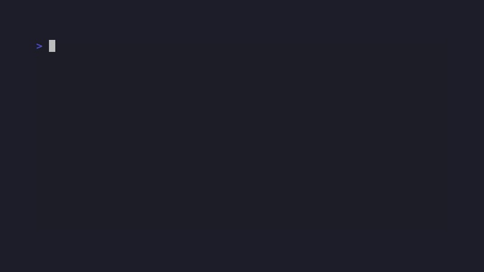
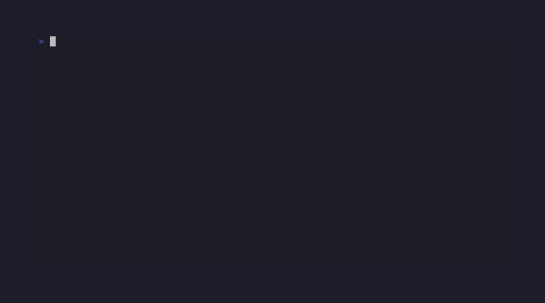

# bound

**bound** is a Rust-based CLI utility for recursively aggregating file contents from directories. It supports language-aware filtering, dependency resolution, token/size/depth limits, and outputs to clipboard or file. Features include **estimated bounding time (EBT)**, **progress reporting**, and telemetry for large-scale processing.

---

## Demo

### Basic Usage


### Filter Syntax ([rs] vs [.rs])


### JSON Output


---

## Features

- **Recursive directory traversal** with `.boundignore` support
- **Language filtering:**
  - `[.ext]` — fetch files with a specific extension (e.g., `[.rs]`, `[rs]`)
  - `{.ext}` — fetch files with extension and referenced dependencies
- **Multiple output formats:**
  - Clipboard (default)
  - File (`--out <filename>`)
  - JSON (`--json`)
- **Content limits:**
  - Token limit (`-t, --token-limit N`)
  - Size limit in bytes (`-s, --size-limit N`)
  - Depth limit (`-d, --depth-limit N`)
- **Metadata & analysis:**
  - `--meta` — Include metadata headers (size, lines, modified time)
  - `--meta-hash` — Include SHA-256 hash in metadata
  - `--tree` — Include file tree visualization
  - `--furnace` — Enable Furnace analysis (stub implementation)
- **Progress telemetry:**
  - Files processed, bytes read, tokens aggregated
  - Estimated bounding time (EBT)
  - Graceful handling of non-UTF-8 files (skipped with warning)

---

## Installation

Requires Rust >= 1.70.

```bash
git clone https://github.com/elci-group/bound.git
cd bound
cargo build --release
```

The binary will be at `target/release/bound`.

---

## Usage

### Basic Examples

```bash
# Aggregate all files in current directory (outputs to clipboard)
bound

# Filter by extension (both syntaxes work)
bound [.rs] .
bound [rs] .

# Include dependency resolution (follows imports/includes)
bound {.py} ./my-project

# Output to file instead of clipboard
bound [.md] > documentation.txt

# Include metadata and file tree
bound [.rs] --meta --tree > codebase.txt
```

### Filter Syntax

| Syntax | Description | Example |
|--------|-------------|---------|
| `[ext]` | Filter by extension only | `bound [rs]` |
| `[.ext]` | Same as above (dot optional) | `bound [.rs]` |
| `{ext}` | Extension + dependency resolution | `bound {.py}` |
| `{.ext}` | Same as above (dot optional) | `bound {.js}` |

### Content Limits

```bash
# Limit tokens per file (splits on whitespace)
bound [.rs] -t 1000

# Limit bytes per file
bound [.rs] -s 50000

# Limit directory traversal depth
bound -d 3
```

### Output Formats

**Default (expandable blocks):**
```bash
bound [.rs] --meta --tree
```

**JSON:**
```bash
bound [.rs] --json > output.json
```

JSON structure:
```json
{
  "tree": "...",
  "files": [
    {
      "metadata": { "relative_path": "...", "size_bytes": 123, ... },
      "content": "...",
      "furnace_report": null
    }
  ]
}
```

### Error Handling

Non-UTF-8 files are automatically skipped with a warning:
```
[1775827984] ⚠️ WARN Skipping /path/to/binary.dat: stream did not contain valid UTF-8
```

---

## Configuration

Create a `.boundignore` file in your project root to exclude files/directories:

```
target/
.git/
node_modules/
*.log
```

---

## Development

```bash
# Build debug version
cargo build

# Build release version
cargo build --release

# Run with arguments
cargo run -- [.rs] --tree
```

---

## License

MIT
